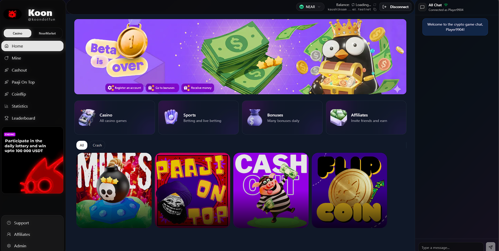
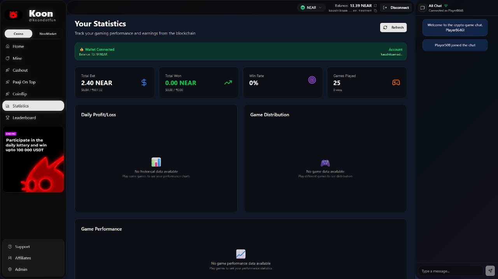
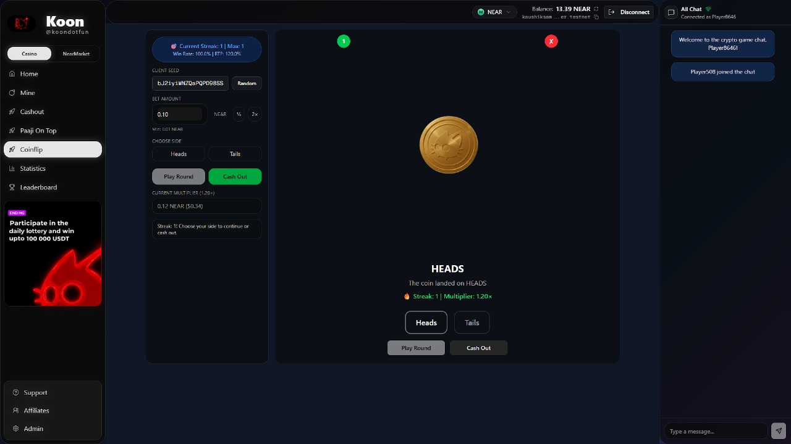
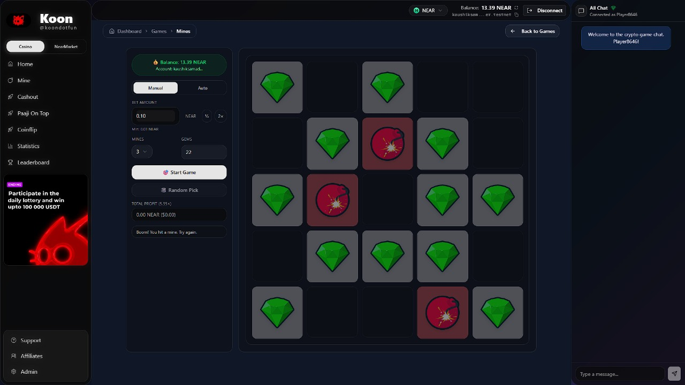
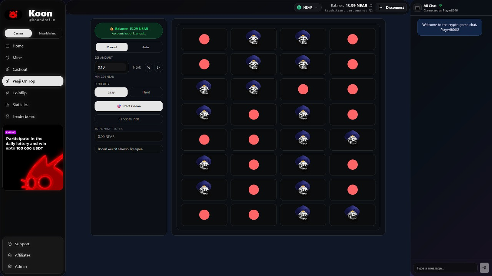
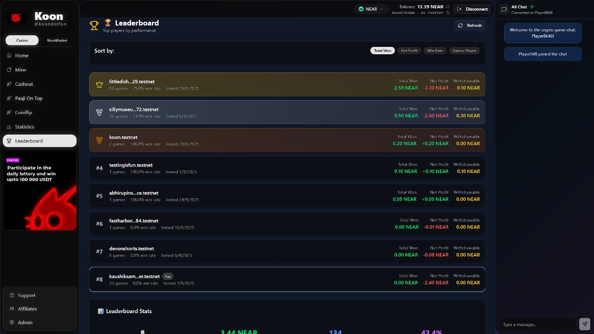

# 🎮 Grass.fun - U2U Gaming Platform

A revolutionary blockchain-based gaming platform built on U2U Solaris Mainnet featuring multiple casino-style games with provably fair mechanics. Play exciting games and win real U2U tokens!

    

<div align="center">
  
  <p><em>Experience the future of decentralized gaming on U2U Solaris</em></p>
</div>

## 🌟 Features

### 🎯 **Multiple Games**
- **Coinflip** - Classic heads or tails with customizable multipliers
- **Mines** - Risk vs reward minefield game with strategic gameplay
- **Rugs (Crash)** - High-stakes crash game with real-time multipliers
- **Paaji On Top** - Unique grid-based game with progressive rewards

### 🔐 **Blockchain Integration**
- **U2U Solaris Mainnet** - Fast, secure, and cost-effective EVM-compatible blockchain
- **Smart Contract** - Transparent, provably fair game logic
- **Automated Resolution** - No manual intervention required
- **Real-time Balance** - Live wallet balance updates
- **EVM Compatible** - Works with MetaMask and other EVM wallets

### 💰 **Financial Features**
- **U2U Token Support** - Native U2U token integration
- **Multi-currency Display** - U2U, USD, INR price conversions
- **Live Exchange Rates** - Real-time U2U price conversion from CoinGecko API
- **Balance Caching** - Optimized performance with smart caching
- **Instant Withdrawals** - Fast and secure U2U token transfers

### 📊 **Analytics & Stats**
- **Personal Statistics** - Detailed gaming performance tracking
- **Leaderboard** - Global player rankings
- **Game History** - Complete transaction history
- **Performance Charts** - Visual analytics and trends

<div align="center">
  
  <p><em>Comprehensive performance tracking and analytics</em></p>
</div>

### 🎨 **Modern UI/UX**
- **Responsive Design** - Works on all devices
- **Dark Theme** - Eye-friendly gaming interface
- **Sound Effects** - Immersive audio feedback
- **Animations** - Smooth, engaging interactions

## 🚀 Quick Start

### Prerequisites
- Node.js 18+ 
- npm or yarn
- EVM-compatible wallet (MetaMask, WalletConnect, etc.)
- U2U tokens for playing games
### Installation

1. **Clone the repository**
```bash
git clone https://github.com/Debanjannnn/Loops Grassdotfun
cd Grassdotfun
```

2. **Install dependencies**
```bash
npm install
```

3. **Start development server**
```bash
npm run dev
```

4. **Open your browser**
Navigate to [http://localhost:3000](http://localhost:3000)

## 🎯 U2U Gaming Features

### 🚀 **Native U2U Integration**

Grass.fun is built specifically for U2U Solaris Mainnet, providing:

#### **Current Features**
- **Native U2U Support** - All games use U2U tokens
- **Real-time Price Conversion** - Live U2U to USD/INR rates from CoinGecko
- **Instant Withdrawals** - Fast and secure U2U token transfers
- **EVM Compatibility** - Works with MetaMask and other EVM wallets

#### **Benefits**
- **Low Fees** - U2U Solaris provides fast, cheap transactions
- **High Performance** - EVM-compatible with superior speed
- **Real-time Updates** - Live price feeds and balance updates
- **Secure Gaming** - All transactions secured by smart contracts

### 🎯 **Future Roadmap**

#### **Phase 1: Core Gaming** ✅
- Multi-game support (Mines, Crash, Paaji, Coinflip)
- Provably fair mechanics
- Real-time price conversion

#### **Phase 2: Enhanced Features** 🚧
- Play any game on any supported chain
- Cross-chain game progression
- Universal asset management

## 🎮 Available Games

### 🪙 Coinflip
- **Objective**: Predict heads or tails
- **Multipliers**: 1.95x for correct prediction
- **Risk Level**: Low
- **Strategy**: Pure chance with optimal betting

<div align="center">
  
  <p><em>Classic heads or tails with instant results</em></p>
</div>

### 💣 Mines
- **Objective**: Find gems while avoiding mines
- **Multipliers**: Up to 24x based on gems found
- **Risk Level**: Medium-High
- **Strategy**: Risk management and timing

<div align="center">
  
  <p><em>Navigate the minefield and collect gems</em></p>
</div>

### 🚀 Rugs (Crash)
- **Objective**: Cash out before the crash
- **Multipliers**: Dynamic, can reach 100x+
- **Risk Level**: High
- **Strategy**: Timing and risk assessment

### 🎯 Paaji On Top
- **Objective**: Navigate the grid to reach the top
- **Multipliers**: Progressive rewards
- **Risk Level**: Medium
- **Strategy**: Path optimization and risk management

<div align="center">
  
  <p><em>Strategic grid navigation with progressive rewards</em></p>
</div>

## 🏆 Global Leaderboard

Compete with players worldwide and climb the rankings!

<div align="center">
  
  <p><em>Track your progress against the best players globally</em></p>
</div>

## 🏗️ Architecture

### Frontend (Next.js 15)
```
components/
├── dashboard/          # Main dashboard components
├── games/             # Game implementations
├── ui/                # Reusable UI components
└── wallet/            # Wallet integration

lib/
├── contractService.ts # Smart contract interactions
├── currencyUtils.ts   # Currency conversion utilities
└── gameOutcomeService.ts # Game resolution logic
```

### Smart Contract (Solidity)
```
contracts/
└── SecureGames.sol    # Main contract logic
    ├── UserStats      # User statistics tracking
    ├── Game           # Game state management
    └── Resolution     # Automated game resolution
```

### Resolver System
```
scripts/
├── resolver.js        # Automated game resolution
├── setup-resolver.js  # Resolver configuration
└── simple-resolver.js # Simplified resolution logic
```

## 🔧 Configuration

### Environment Variables

Create a `.env.local` file in the root directory:

```env
# U2U Solaris Configuration
NEXT_PUBLIC_CHAIN_ID=39
NEXT_PUBLIC_CONTRACT_ADDRESS=0x4141fE3C1bD052dCcAb0fc54A816672447cDf14F

# WalletConnect Configuration
NEXT_PUBLIC_WALLETCONNECT_PROJECT_ID=your-project-id

# Optional
DEBUG=false
```

### Smart Contract Deployment

1. **Install dependencies**
```bash
npm install
```

2. **Compile the contract**
```bash
npx hardhat compile
```

3. **Deploy to U2U Solaris Mainnet**
```bash
npx hardhat run scripts/deploy.js --network u2uSolaris
```

4. **Verify the contract**
```bash
npx hardhat verify --network u2uSolaris <CONTRACT_ADDRESS>
```

## 📋 Contract Information

### Current Deployment
- **Network**: U2U Solaris Mainnet (Chain ID: 39)
- **Contract Address**: `0x4141fE3C1bD052dCcAb0fc54A816672447cDf14F`
- **Deployer**: `0x2D4575003f6017950C2f7a10aFb17bf2fBb648d2`
- **Transaction Hash**: `0x249a4316ccc0bb09f47d586f76b82c81de1c84f22555a52ba66e937e169509ef`
- **Block Number**: 40015168
- **Deployed**: October 5, 2025

### Contract Features
- ✅ **Provably Fair Gaming** - All games use transparent, verifiable mechanics
- ✅ **Multi-Game Support** - Mines, Crash, Paaji, Coinflip
- ✅ **User Statistics** - Complete gaming history and performance tracking
- ✅ **Instant Withdrawals** - Fast and secure U2U token transfers
- ✅ **Real-time Price Conversion** - Live U2U to USD/INR rates

## 🎯 Game Resolution System

Grass.fun uses an automated resolver system that processes game outcomes without user intervention:

### How It Works
1. **User plays game** → Game state stored on-chain via smart contract
2. **Automated resolution** → Games are resolved based on provably fair outcomes
3. **Winnings credited** → Users can withdraw U2U tokens from stats page
4. **Real-time updates** → All statistics and balances update instantly

### Resolution Features
- ✅ **Provably Fair** - All game outcomes are transparent and verifiable
- ✅ **Instant Processing** - Games resolve immediately after completion
- ✅ **Secure Withdrawals** - U2U tokens transferred directly to user wallets
- ✅ **Complete History** - All games and transactions are recorded on-chain

## 📊 Smart Contract Methods

### User Methods
- `startGame(gameId, gameType)` - Start a new game with U2U bet
- `withdraw()` - Withdraw winnings to wallet
- `getUserStats(address)` - Get user statistics

### Game Types
- `"mines"` - Minesweeper game
- `"crash"` - Crash multiplier game  
- `"paaji"` - Paaji On Top game
- `"coinflip"` - Coin flip game

### Contract Events
- `GameStarted(address indexed player, string gameId, string gameType, uint256 betAmount)`
- `GameResolved(address indexed player, string gameId, bool didWin, uint256 multiplier)`
- `Withdrawal(address indexed player, uint256 amount)`

## 🚀 Deployment

### Vercel Deployment

1. **Connect to Vercel**
```bash
npm install -g vercel
vercel login
```

2. **Deploy**
```bash
vercel --prod
```

3. **Set Environment Variables**
In Vercel dashboard, add:
- `CONTRACT_ID=game-v0.testnet`
- `RESOLVER_ACCOUNT_ID=resolver-v0.testnet`
- `RESOLVER_PRIVATE_KEY=ed25519:YOUR_KEY`

### Production Setup

See [PRODUCTION_SETUP.md](./PRODUCTION_SETUP.md) for detailed production deployment instructions.

## 🛠️ Development

### Available Scripts

```bash
# Development
npm run dev              # Start development server
npm run build           # Build for production
npm run start           # Start production server
npm run lint            # Run ESLint

# Resolver
npm run setup-resolver  # Setup resolver configuration
npm run resolver        # Run resolver once
npm run resolver:watch  # Run resolver continuously
```

### Project Structure

```
Grassdotfun/
├── app/                    # Next.js app router pages
├── components/             # React components
│   ├── dashboard/         # Dashboard components
│   ├── games/             # Game implementations
│   └── ui/                # UI components
├── contexts/              # React contexts
├── lib/                   # Utility libraries
├── contracts/             # U2U smart contract
├── scripts/               # Resolver scripts
└── public/                # Static assets
```

## 🔒 Security Features

- **Provably Fair** - All game outcomes are verifiable on-chain
- **Automated Resolution** - No manual intervention required
- **Private Key Security** - Resolver keys stored securely
- **Access Control** - Only authorized accounts can resolve games
- **Transparent Transactions** - All actions recorded on blockchain

## 📈 Performance Optimizations

- **Balance Caching** - 30-second cache reduces API calls by 90%
- **Multiple RPC Endpoints** - Automatic fallback for reliability
- **Smart Retry Logic** - Handles network issues gracefully
- **Optimized Rendering** - React optimizations for smooth gameplay

## 🤝 Contributing

1. Fork the repository
2. Create a feature branch (`git checkout -b feature/amazing-feature`)
3. Commit your changes (`git commit -m 'Add amazing feature'`)
4. Push to the branch (`git push origin feature/amazing-feature`)
5. Open a Pull Request

## 📄 License

This project is licensed under the MIT License - see the [LICENSE](LICENSE) file for details.

## 🆘 Support

- **Documentation**: Check the `/docs` folder for detailed guides
- **Issues**: Report bugs via GitHub Issues
- **Discord**: Join our community for support
- **Email**: Contact us at support@Grassdotfun.games

## 🎯 Roadmap

### 🌉 **Cross-Chain Features**
- [x] **NEAR Intents Integration** - Cross-chain withdrawals via NEAR Intents
- [ ] **Multi-Chain Gaming** - Play games on multiple blockchains
- [ ] **Universal Leaderboard** - Cross-chain player rankings
- [ ] **Cross-Chain Tournaments** - Multi-chain competitive events

### 🎮 **Gaming Features**
- [ ] **Mobile App** - React Native mobile application
- [ ] **Tournament Mode** - Competitive gaming tournaments
- [ ] **NFT Integration** - Gaming NFTs and rewards
- [ ] **Social Features** - Friends, chat, and social gaming
- [ ] **More Games** - Additional game types and variations

### 🔧 **Technical Improvements**
- [ ] **Layer 2 Integration** - Support for U2U L2s
- [ ] **Advanced Analytics** - Enhanced performance tracking
- [ ] **AI-Powered Features** - Smart game recommendations
- [ ] **Enterprise APIs** - Developer tools and integrations

## 🙏 Acknowledgments

- **U2U Solaris** - For the amazing EVM-compatible blockchain infrastructure
- **Next.js Team** - For the excellent React framework
- **Open Source Community** - For the incredible tools and libraries

---

**Built with ❤️ by the Grassdotfun Team**

*Experience the future of decentralized gaming on U2U Solaris*
